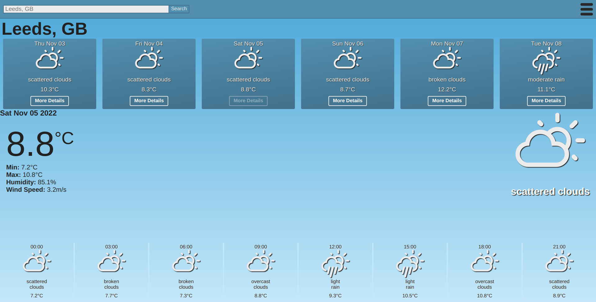
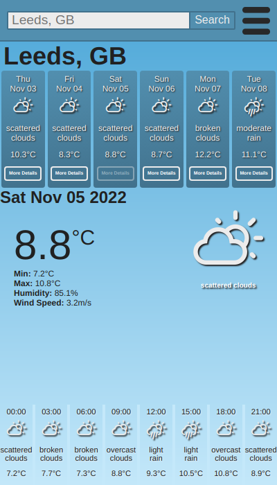

# Weather App

Weather app that interacts with an OpenWeatherMap API to get up to date weather forecast and displays that data using React.

Created as part of the Manchester Codes full-stack web development boot-camp.

## Table of Contents

1. [Features](#features)
1. [Live Preview](#live preview)
1. [Dependencies](#dependencies)
1. [Setup](#setup)
1. [Commands](#commands)
1. [Attribution](#attribution)

## Features

- Uses OpenWeatherMap API to provide global weather forecast data.
- To get a forecast search for a city or town. An optional country code can be added to further specify the location (e.g. "London" and "London, CA").
- API provides data on a tri-hourly basis for 5-days. Because of how the forecast is retrieved this usually leads to a 6 day forecast, with missing data sets for the beginning of the first day and end of the last. For more information about the API please visit [OpenWeatherMap](https://openweathermap.org/current).
- The daily-summary displays the mean temp for that day and the first weather condition from the dataset for that day.
- The forecast breakdown shows the calculated mean temperature, humidity and wind speed, and calculated max and minimum temperatures from all datasets for that day and the first weather condition from the dataset for that day.
- The tri-hourly forecast shows the retrieved mean temperature and weather condition for the three hour period. If no data is retrieved for a given period, "No Data" is shown in its place.
- The units of the retrieved data can be changed from the drop-down options menu. Available units are standard (K, m/s), metric (°C, m/s) or imperial (°F, mph).

## [Live Preview](https://perrybaran.github.io/weather-app)





## Dependencies

- [react](https://reactjs.org/)
- [axios](https://www.npmjs.com/package/axios)
- [uuid](https://www.npmjs.com/package/uuid)
- [react-icons-weather](https://www.npmjs.com/package/react-icons-weather)
- [prop-types](https://www.npmjs.com/package/prop-types)

### Dev Dependencies

- [prettier](https://prettier.io/docs/en/install.html)
- [gh-pages](https://www.npmjs.com/package/gh-pages)

## Setup

### Install Dependencies

1. Clone the repo to a local file.

```
$ git clone https://github.com/PerryBaran/weather-app
```

2. Install all dependencies.

```
$ npm i
```

## Commands

```
$ npm start
```

Runs the app in the development mode.\
Open [http://localhost:3000](http://localhost:3000) to view it in the browser.

The page will reload if you make edits.\
You will also see any lint errors in the console.

```
$ npm test
```

Launches the test runner in the interactive watch mode.\
See the section about [running tests](https://facebook.github.io/create-react-app/docs/running-tests) for more information.

```
$ npm build
```

Builds the app for production to the `build` folder.\
It correctly bundles React in production mode and optimizes the build for the best performance.

```
$ npm run lint:fix
```

Runs eslint on all files to format code.

```
$ npm run prettier
```

runs prettier on all files to formal code.

```
$ npm run predeploy
```

helps to bundle the react app. This command is run automatically when running deploy.

```
$ npm run deploy
```

Generates a production build of the app and deploys it to GitHub pages.

## Attribution

Created by **Perry Baran**.
